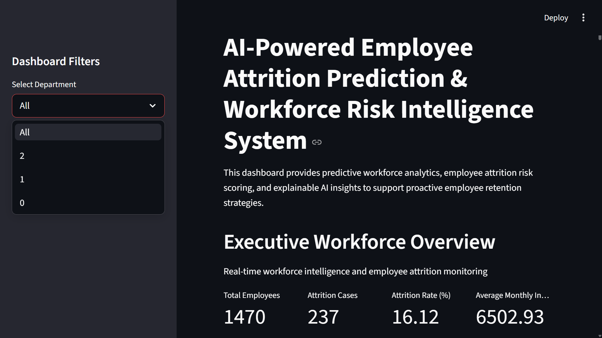
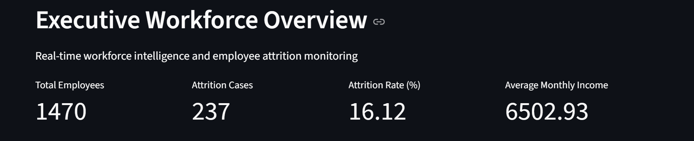
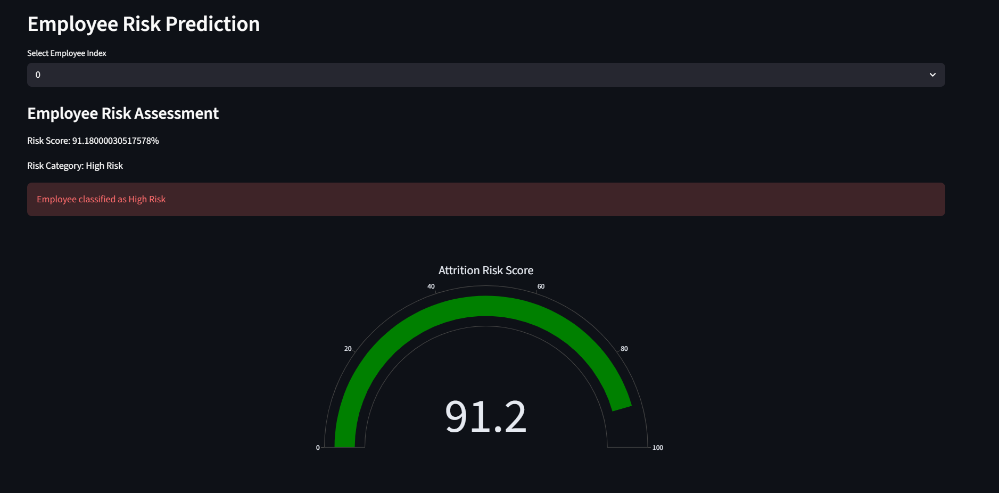
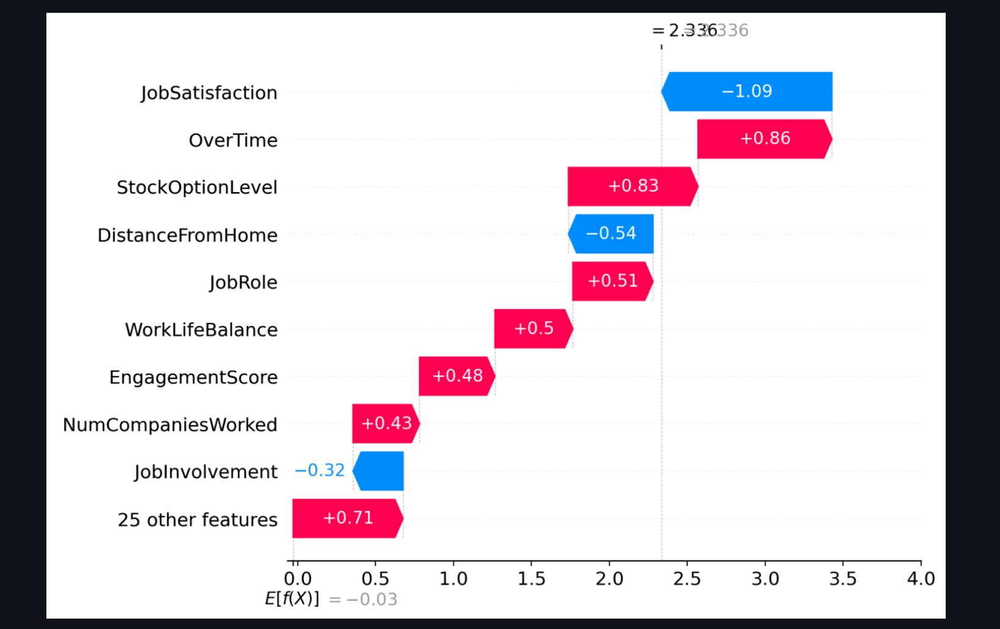

# 🚀 AI-Powered Employee Attrition Prediction & Workforce Risk Intelligence System

An end-to-end Machine Learning and Explainable AI project focused on predicting employee attrition risk and generating workforce intelligence insights using interactive analytics dashboards.

---

## 📌 Project Overview

This project was developed to analyze employee attrition patterns and identify employees who may be at risk of leaving an organization.

The system combines:

* 🤖 Machine Learning
* 📊 Workforce Analytics
* 🧠 Explainable AI (SHAP)
* 🌐 Streamlit Dashboard
* 📈 Interactive Visualizations

The project helps organizations make proactive employee retention decisions using predictive analytics and business intelligence insights.

---

## ✨ Key Features

* 🔍 Employee Attrition Prediction
* 📉 Workforce Risk Scoring
* 🧠 SHAP Explainability
* 📊 Interactive Streamlit Dashboard
* 🏢 Department-wise Attrition Analysis
* ⏱️ Overtime Impact Analysis
* 🚨 High-Risk Employee Monitoring
* 📥 Downloadable Workforce Reports

---

## 🛠️ Machine Learning Workflow

### 📂 Data Preprocessing

* Missing value validation
* Categorical encoding
* Feature scaling
* SMOTE for class imbalance handling

### ⚙️ Models Implemented

* Logistic Regression
* Random Forest Classifier
* XGBoost Classifier

### 🏆 Final Selected Model

* XGBoost Classifier

---

## 💻 Technologies Used

| Category       | Technologies          |
| -------------- | --------------------- |
| Programming    | Python                |
| ML Libraries   | Scikit-learn, XGBoost |
| Data Analysis  | Pandas, NumPy         |
| Explainable AI | SHAP                  |
| Visualization  | Plotly, Matplotlib    |
| Deployment     | Streamlit             |

---

## 🌐 Live Deployment

🔗 **Streamlit Application**
https://employee-attrition-intelligence-system-j2gwo8jkucucpgmjmfk4wx.streamlit.app/

---

## 📸 Dashboard Screenshots

### 🏠 Dashboard Homepage

```md

```


---

### 📊 Executive Workforce KPI Dashboard

```md

```


---

### 🚨 Employee Risk Prediction

```md

```


---

### 🧠 SHAP Explainability Analysis

```md

```


---

## 📈 Business Insights

* Employees working overtime showed higher attrition probability.
* Lower job satisfaction strongly influenced employee turnover.
* Poor work-life balance contributed to workforce risk.
* Promotion delays affected employee retention trends.

### ✅ Recommended Actions

* Improve employee wellness initiatives
* Reduce excessive overtime workloads
* Strengthen career development programs
* Enhance employee engagement strategies

---

## 📂 Project Structure

```bash
employee-attrition-intelligence-system/
│
├── data/
├── notebooks/
├── models/
├── reports/
├── images/
├── streamlit_app.py
├── requirements.txt
├── README.md
└── .gitignore
```

---

## ▶️ How to Run the Project

### 1️⃣ Clone Repository

```bash
git clone https://github.com/raghu-3113/employee-attrition-intelligence-system.git
```

### 2️⃣ Install Dependencies

```bash
pip install -r requirements.txt
```

### 3️⃣ Run Streamlit Application

```bash
streamlit run streamlit_app.py
```

---

## 📄 Internship Report

The complete project report is available inside the `reports/` folder.

---

## 🔮 Future Improvements

* Real-time HR database integration
* Advanced workforce forecasting
* Deep learning-based prediction models
* Automated retention recommendation systems

---

## 👨‍💻 Author

### Raghu Babu

🎓 B.Tech – Artificial Intelligence & Data Science
🚀 Aspiring AI Engineer

🔗 LinkedIn
https://www.linkedin.com/in/raghu-babu-654b96324/

🔗 GitHub
https://github.com/raghu-3113
